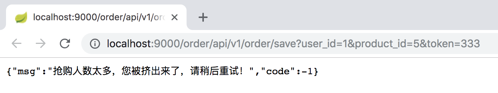

# Spring Cloud实战
  最近因为项目需要在学习微服务架构，看了一些公开课和博客，对微服务有了一些了解；然后在对比了几个目前主流的微服务框架后，最终选择Spring Cloud实战了一下，有了一些心得体会。
  
  参考资料：
  >* [什么是微服务？](https://www.sohu.com/a/221400925_100039689)
  >* [什么是微服务架构？](https://www.zhihu.com/question/65502802?sort=created)
  >* [一个微服务框架的情节](https://www.jianshu.com/p/ff24b87316d3)
  >* [Dubbo和Spring Cloud微服务架构对比](https://blog.csdn.net/zhangweiwei2020/article/details/78646252)
  >* [Spring Cloud在国内中小型公司能用起来吗？](https://mp.weixin.qq.com/s?__biz=MzI4NDY5Mjc1Mg==&mid=2247483976&idx=1&sn=8772578e5c096e0da99b32f3f005e05a&scene=21#wechat_redirect)
  >* [中小型互联网公司微服务实践-经验和教训](https://mp.weixin.qq.com/s?__biz=MzI4NDY5Mjc1Mg==&mid=2247484078&idx=1&sn=7e0eeb1865ec2d7af3dc42f14d0ea324&chksm=ebf6dad1dc8153c7d74f4e221a4bcd8a76be3d269d27f4537d891b6a0f79a7344c08134fc137&scene=21#wechat_redirect)
  >* [微服务领域,为什么选SpringCloud而不是Dubbo?](https://blog.csdn.net/whusj/article/details/80709793)

## Spring Cloud实战项目

  项目的需求是开发一个电商网站后台，根据业务将系统拆分为用户服务、商品服务、订单服务、积分服务等。项目的目的是为了实战Spring Cloud的主要组件，因此并没有将所有服务都开发得很完善，但一个微服务系统应具备的要素已经齐了：**注册中心、配置中心、各个服务（包括服务间调用、负载均衡、熔断降级、链路追踪）、网关、服务打包、容器部署**。整个项目分为以下几部分：
  
  [eureka_server](https://github.com/pwalan/eureka_server.git): 服务注册中心
  
  [config_server](https://github.com/pwalan/config-server.git): 配置中心
  
  [product_service](https://github.com/pwalan/product_service.git): 商品服务
  
  [order_service]()
  
  
### 服务注册发现

### 服务消费者与负载均衡

### 服务降级与熔断

### 微服务网关

### 分布式链路追踪

### 配置中心

### 消息总线与消息队列

### 服务打包与容器部署

