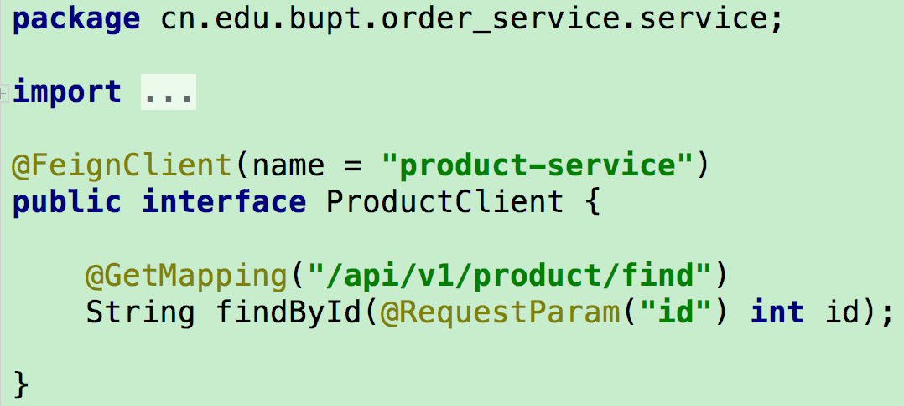
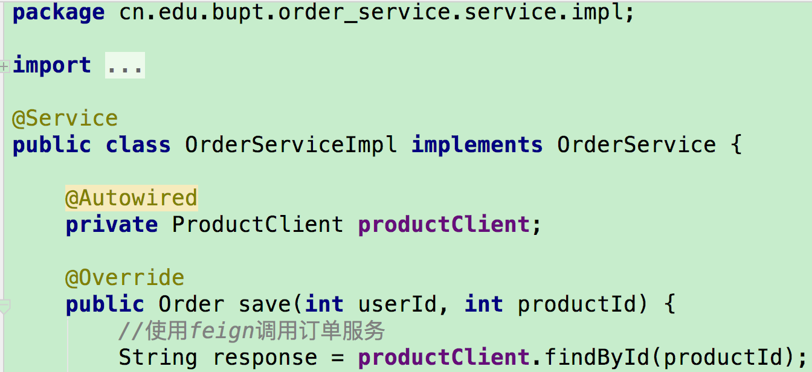

# Spring Cloud实战
  最近因为项目需要在学习微服务架构，看了一些公开课和博客，对微服务有了一些了解；然后在对比了几个目前主流的微服务框架后，最终选择Spring Cloud实战了一下，有了一些心得体会。
  
  参考资料：
  >* [什么是微服务？](https://www.sohu.com/a/221400925_100039689)
  >* [什么是微服务架构？](https://www.zhihu.com/question/65502802?sort=created)
  >* [一个微服务框架的情节](https://www.jianshu.com/p/ff24b87316d3)
  >* [Dubbo和Spring Cloud微服务架构对比](https://blog.csdn.net/zhangweiwei2020/article/details/78646252)
  >* [Spring Cloud在国内中小型公司能用起来吗？](https://mp.weixin.qq.com/s?__biz=MzI4NDY5Mjc1Mg==&mid=2247483976&idx=1&sn=8772578e5c096e0da99b32f3f005e05a&scene=21#wechat_redirect)
  >* [中小型互联网公司微服务实践-经验和教训](https://mp.weixin.qq.com/s?__biz=MzI4NDY5Mjc1Mg==&mid=2247484078&idx=1&sn=7e0eeb1865ec2d7af3dc42f14d0ea324&chksm=ebf6dad1dc8153c7d74f4e221a4bcd8a76be3d269d27f4537d891b6a0f79a7344c08134fc137&scene=21#wechat_redirect)
  >* [微服务领域,为什么选SpringCloud而不是Dubbo?](https://blog.csdn.net/whusj/article/details/80709793)


## Spring Cloud实战项目

  本实战项目的需求是开发一个电商网站后台，根据业务将系统拆分为用户服务、商品服务、订单服务、积分服务等。项目的目的是为了实战Spring Cloud的主要组件，因此并没有将所有服务都开发得很完善，但一个微服务系统应具备的要素已经齐了：**注册中心、配置中心、各个服务（包括服务间调用、负载均衡、熔断降级、链路追踪）、网关、服务打包、容器部署**。
  
  整个项目分为以下几部分：
  
  - [eureka_server](https://github.com/pwalan/eureka_server.git) 服务注册中心：每个服务都需要在服务注册中心进行注册，并可以获取其他服务的地址。
  
  - [config_server](https://github.com/pwalan/config-server.git) 配置中心：每个服务的配置（如端口、数据库配置），除去基本配置（如eureka的地址等），都可以放到配置中心进行统一管理。配置中心可以和消息队列配合，做到动态更新各个服务的配置。
  
  - [product_service](https://github.com/pwalan/product_service.git) 商品服务：提供展示商品列表和查询商品详情的接口。
  
  - [order_service](https://github.com/pwalan/order_service.git) 订单服务：提供下单接口，需要调用商品服务。
  
  - [api-gateway](https://github.com/pwalan/api-gateway.git) 网关：提供统一的对外接口，隔离内外网；提供路由功能，转发请求；进行权限验证和身份校验；并能够限流。
  
### 1.服务注册发现
为什么需要服务注册中心：
> 微服务应用和机器越来越多，调用方需要知道接口的网络地址，如果靠配置文件的方式去控制网络地址，对于动态新增机器，维护带来很大问题

主流的注册中心：
> Zookeeper、Eureka、Consul、Etcd等

如何选择：
> CAP的定理，在一个分布式系统中，Consistency（一致性）、 Availability（可用性）、Partition tolerance（分区容错性），三者不可同时获得。

由于当前的网络硬件肯定会出现延迟丢包等问题，所以分区容忍性(P)是我们必须需要实现的。所以我们只能在一致性(C)和可用性(A)之间进行权衡：
>* 如果要求一致性，则选择Zookeeper(CP)，如金融行业
>* 如果要求可用性，则Eureka(AP)，如电商系统

### 2.服务消费者与负载均衡
常用的服务间调用的方式有：
>* RPC: 远程过程调用，像调用本地服务(方法)一样调用服务器的服务,支持同步、异步调用，数据包小
>* REST: 即HTTP请求，支持多种协议和功能，开发方便，成本低，但数据包大

SpringCloud中有Ribbon和Feign两个组件支持服务间调用，二者都是采用REST方式，但由于以下原因一般选用Feign
>* Feign默认集成了Ribbon，也集成了Ribbon的负载均衡策略
>* 写起来更加思路清晰和方便
>* 采用注解方式进行配置，配置熔断(下一节将介绍)等方式方便

下面介绍一下Ribbon的负载均衡策略，默认是Round-Robin，不过可以通过配置文件进行设置，也可以[自定义负载均衡策略](http://cloud.spring.io/spring-cloud-static/Finchley.RELEASE/single/spring-cloud.html#_customizing_the_ribbon_client_by_setting_properties)。如下图所示，在Eureka上注册了3个商品服务，然后进行多次查询商品详情，可以看到每次请求都是不同的端口,而且是有序的，说明了其负载均衡策略是Round-Robin。


下面说明一下使用Feign后，订单服务如何调用商品服务进行下单：
>* 在启动类中添加 ```@EnableFeignClients```
>* 在service包中添加一个商品服务的接口，并添加```@FeignClient(name="product-service")```，如下图所示
>* 在要用到商品服务的地方进行注入，然后调用即可，如下图所示


### 3.服务降级与熔断


### 4.微服务网关


### 5.分布式链路追踪


### 6.配置中心


### 7.消息总线与消息队列


### 8.服务打包与容器部署


